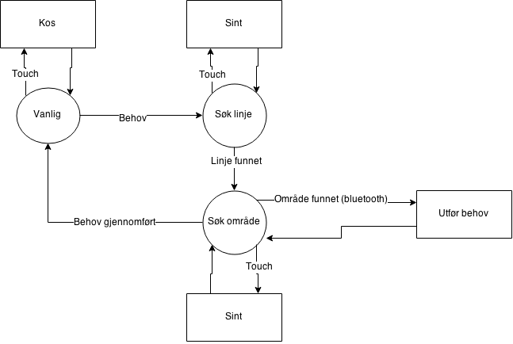

# XBot
Proglab

## Brainstorming på Xbot
* Hva skal den gjøre? 
* Hvor skal den bo? 
* Hvordan skal den interagere med folk? 

## Realisering
* Hvilke sensorer og aktuatorer vil vi bruke? 
* Interaksjon med omgivelsene, med hjelpebotene og med folk. 
* Hvordan skal Xboten og hjelpebotene kommunisere. 

## Video
* Går enten for en "jurrassic park" greie, eller...
* ... en cheezy, amerikansk eller japansk reklame som highlighter de imponernede og mindre imponerende aspektene av systemet.
* ... eller BEGGE.

# Kalender
### (Uke 14&15: Påske)
### Uke 16 (13S17 april): 
* Koble til siste bot i nettverket.
* Koble til bluetooth-sensor til bluetoothbot (0), og koble den sammen med zumo.
* Programmere robotlogikk (oppførsel, humør, sensorinput(?), oppdage linjer, verdier for behov, melde via bluetooth om behov)
* Bekrefte at dette virker med nettverk.
* Skriv "brukbar" output for bruker på LCD (smileys, verdier for tørst, sult, kos, etc)
* Legg til ekstrafunksjoner om det finnes tid for det.
* Lage og redigere video.

### Uke 17 (ingen øvinger): 
* Mandag 20.04 er det sluttpresentasjon med alle videoene som Kahootkonkurranse. 

## Tilstandsdiagram for Xbot
